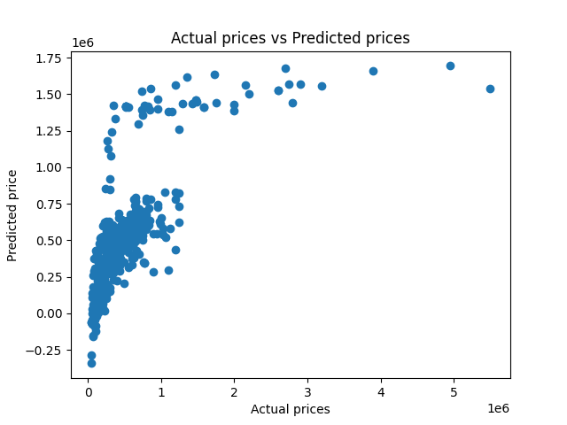
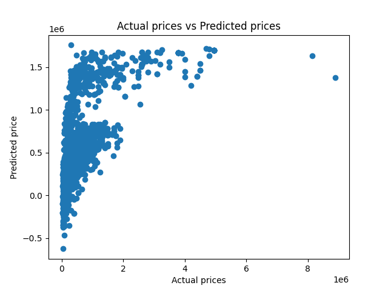

# 🚗 Used Car Price Prediction

Predicts the selling price of a used car from its age, kilometres driven, fuel type, seller type, transmission and ownership history. Two regression models, **Linear Regression** and **Lasso Regression**, are trained and compared using R² score and actual-vs-predicted plots.

## 📊 Results

Both models were trained on 90% of the data and evaluated on the remaining 10% (`random_state=2`).

| Model | R² (train) | R² (test) |
|---|---|---|
| Linear Regression | 0.428 | 0.503 |
| Lasso Regression | 0.428 | 0.503 |

Linear and Lasso score almost identically here. With only 6 features and no heavy multicollinearity, Lasso's regularisation has very little to remove.

### Actual vs Predicted Prices

| | Training set | Test set |
|---|---|---|
| **Linear Regression** |  |  |
| **Lasso Regression** |  |  |

A perfect model would put every point on a diagonal line. The plots show the models track the general trend for cheaper cars but underpredict expensive ones, and they sometimes predict negative prices.

## 🗂️ Dataset

`data/car_data.csv` has **4,340 used-car listings** with no missing values.

| Column | Description |
|---|---|
| `name` | Car make and model (dropped before training) |
| `year` | Year of manufacture |
| `selling_price` | **Target**: selling price in ₹ |
| `km_driven` | Kilometres driven |
| `fuel` | Petrol, Diesel, CNG, LPG, Electric |
| `seller_type` | Individual, Dealer, Trustmark Dealer |
| `transmission` | Manual, Automatic |
| `owner` | First, Second, Third, Fourth & Above Owner, Test Drive Car |

## 🔧 How It Works

1. **Load** the CSV with pandas and check for missing values and category counts.
2. **Encode** the categorical columns (`fuel`, `seller_type`, `transmission`, `owner`) as integers.
3. **Split** features and target (`selling_price`), dropping `name`, then split 90/10 into train and test sets.
4. **Train** Linear Regression and Lasso Regression.
5. **Evaluate** with R² on both sets and save actual-vs-predicted scatter plots to `images/`.

## 📁 Project Structure

```
car-price-prediction/
├── data/
│   └── car_data.csv
├── images/
│   ├── linear_regression_train.png
│   ├── linear_regression_test.png
│   ├── lasso_regression_train.png
│   └── lasso_regression_test.png
├── src/
│   └── car_price.py
├── requirements.txt
├── .gitignore
├── LICENSE
└── README.md
```

## 🚀 Getting Started

```bash
git clone https://github.com/<your-username>/car-price-prediction.git
cd car-price-prediction
pip install -r requirements.txt
python src/car_price.py
```

The script prints the R² scores and regenerates the plots in `images/`. Paths are relative, so it runs from anywhere.

## 🛠️ Tech Stack

Python · pandas · scikit-learn · matplotlib

## ⚠️ Limitations and Next Steps

- **Moderate accuracy (R² ≈ 0.50 on test).** A linear model can't capture how car prices change non-linearly with age and brand.
- **Categories are label-encoded as 0, 1, 2…**, which implies an order that doesn't exist for `fuel` and `seller_type`. One-hot encoding would be more appropriate.
- **Car brand is ignored.** `name` is dropped, but the brand is a strong price signal. Extracting it as a feature should help.
- **Prices are heavily skewed.** Predicting `log(selling_price)` would likely fix the negative predictions and improve fit.
- **Try other models:** Random Forest or Gradient Boosting, with cross-validation.

## 📄 License

Released under the [MIT License](LICENSE).
